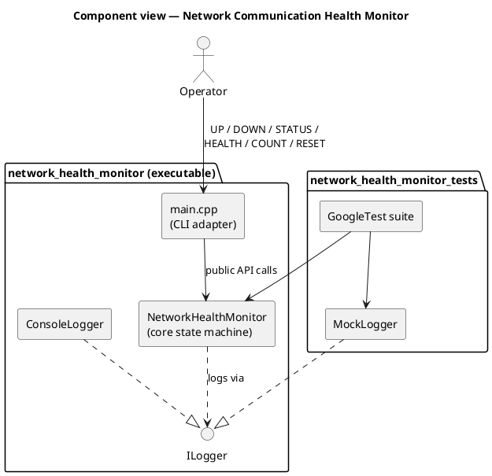
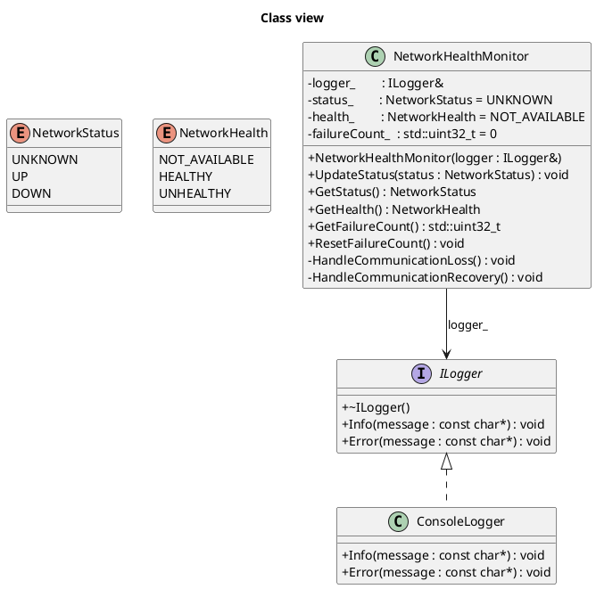
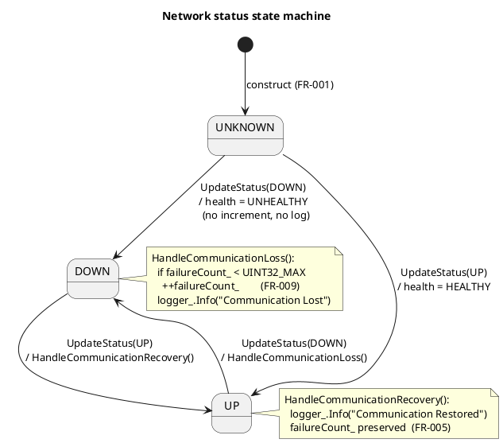
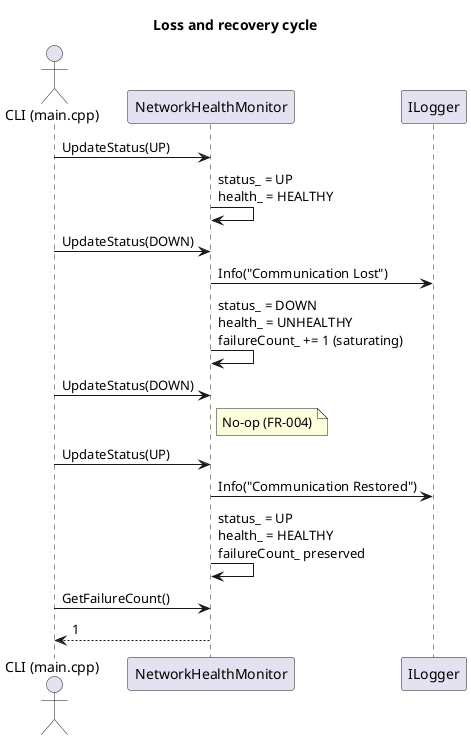

# Software Design Description (SWDD)

## Network Communication Health Monitor

| Field | Value |
|---|---|
| Component | Network Communication Health Monitor |
| Language | C++17 |
| Related | [Requirement.md](Requirement.md) |

---

## 1. Purpose and scope

This SWDD refines the requirements in [Requirement.md](Requirement.md) into an implementable
design for the training MVP. It covers:

- The core state-machine class `NetworkHealthMonitor`.
- The logging abstraction `ILogger` and its `ConsoleLogger` implementation.
- The CLI application in `main.cpp` (FR-010).

Out of scope: real CAN/Ethernet, AUTOSAR RTE, ECU hardware, functional-safety qualification,
and any modification of the production `rbNetComCtrl_x` code path.

---

## 2. Architecture



---

## 3. Static structure

### 3.1 Class diagram



### 3.2 Files

```
Network_req/
├── Doczzz/
│   ├── Requirement.md
│   └── SWDD.md
├── include/
│   ├── ILogger.hpp
│   └── NetworkHealthMonitor.hpp
├── src/
│   ├── NetworkHealthMonitor.cpp
│   ├── ConsoleLogger.cpp
│   └── main.cpp
└── test/
    ├── MockLogger.hpp
    └── NetworkHealthMonitorTest.cpp
```

---

## 4. Behavior

### 4.1 State machine



### 4.2 Transition table (normative)

| Current → Input | New state | Health | Counter | Log |
|---|---|---|---|---|
| `UNKNOWN` → `UP`   | `UP`   | `HEALTHY`   | — | — |
| `UNKNOWN` → `DOWN` | `DOWN` | `UNHEALTHY` | — | — |
| `UP` → `UP`        | `UP`   | `HEALTHY`   | — | — |
| `UP` → `DOWN`      | `DOWN` | `UNHEALTHY` | **+1 (saturating at `UINT32_MAX`)** | `Communication Lost` |
| `DOWN` → `DOWN`    | `DOWN` | `UNHEALTHY` | — | — |
| `DOWN` → `UP`      | `UP`   | `HEALTHY`   | preserved | `Communication Restored` |

Log strings shall match exactly: `Communication Lost`, `Communication Restored`.

### 4.3 UpdateStatus algorithm

```text
procedure UpdateStatus(newStatus):
    if newStatus == status_:
        return                                # idempotent (FR-004 for DOWN)

    if status_ == UP and newStatus == DOWN:
        HandleCommunicationLoss()             # FR-003
    else if status_ == DOWN and newStatus == UP:
        HandleCommunicationRecovery()         # FR-005

    status_  = newStatus
    health_  = (newStatus == UP) ? HEALTHY : UNHEALTHY

procedure HandleCommunicationLoss():
    if failureCount_ < UINT32_MAX:            # FR-009
        failureCount_ = failureCount_ + 1
    logger_.Info("Communication Lost")

procedure HandleCommunicationRecovery():
    logger_.Info("Communication Restored")
    # failureCount_ preserved (FR-005)
```

### 4.4 Sequence: `UP → DOWN → DOWN → UP`



---

## 5. Interfaces

### 5.1 Public API

```cpp
// include/NetworkHealthMonitor.hpp
#pragma once
#include <cstdint>
#include "ILogger.hpp"

enum class NetworkStatus { UNKNOWN, UP, DOWN };
enum class NetworkHealth { NOT_AVAILABLE, HEALTHY, UNHEALTHY };

class NetworkHealthMonitor
{
public:
    explicit NetworkHealthMonitor(ILogger& logger);

    void          UpdateStatus(NetworkStatus status);
    NetworkStatus GetStatus() const noexcept;
    NetworkHealth GetHealth() const noexcept;
    std::uint32_t GetFailureCount() const noexcept;
    void          ResetFailureCount() noexcept;

private:
    void HandleCommunicationLoss();
    void HandleCommunicationRecovery();

    ILogger&      logger_;
    NetworkStatus status_       {NetworkStatus::UNKNOWN};
    NetworkHealth health_       {NetworkHealth::NOT_AVAILABLE};
    std::uint32_t failureCount_ {0U};
};
```

### 5.2 Logger interface

```cpp
// include/ILogger.hpp
#pragma once

class ILogger
{
public:
    virtual ~ILogger() = default;
    virtual void Info(const char* message)  = 0;
    virtual void Error(const char* message) = 0;
};
```

### 5.3 CLI protocol (FR-010)

One command per line on `stdin`; result printed on `stdout`. Commands are case-insensitive.

| Command | Effect | Output |
|---|---|---|
| `UP`    | `UpdateStatus(UP)`   | `ok` |
| `DOWN`  | `UpdateStatus(DOWN)` | `ok` |
| `STATUS`| — | `UNKNOWN` / `UP` / `DOWN` |
| `HEALTH`| — | `NOT_AVAILABLE` / `HEALTHY` / `UNHEALTHY` |
| `COUNT` | — | decimal failure count |
| `RESET` | `ResetFailureCount()` | `ok` |
| `QUIT`  | Exit with code `0` | — |

---

## 6. Data invariants

| Member | Type | Invariant |
|---|---|---|
| `status_` | `NetworkStatus` | `UNKNOWN` only at construction; never re-entered |
| `health_` | `NetworkHealth` | `NOT_AVAILABLE` iff `status_ == UNKNOWN`; `HEALTHY` iff `UP`; `UNHEALTHY` iff `DOWN` |
| `failureCount_` | `std::uint32_t` | `0 ≤ failureCount_ ≤ UINT32_MAX`; non-decreasing except via `ResetFailureCount()` |
| `logger_` | `ILogger&` | Valid for the lifetime of the monitor |

The core class is not thread-safe; callers must serialize access. It performs no I/O,
allocates no heap memory, and uses no timers.

---

## 7. Test design

- Framework: GoogleTest via CMake `FetchContent`.
- Every test uses `MockLogger` — never `ConsoleLogger`.
- Test names embed the FR ID, e.g. `FR003_UpToDown_IncrementsFailureCountAndLogsLost`.
- Coverage target: **≥ 80 %** line coverage on `src/NetworkHealthMonitor.cpp` (NFR-003).

| Test ID | Scenario | Requirement |
|---|---|---|
| TC-001 | Construction defaults | FR-001 |
| TC-002 | First `UP` update | FR-002 |
| TC-003 | `UP → DOWN` | FR-003 |
| TC-004 | Repeated `DOWN` | FR-004 |
| TC-005 | `DOWN → UP` | FR-005 |
| TC-006 | `GetHealth()` | FR-006 |
| TC-007 | `GetFailureCount()` | FR-007 |
| TC-008 | `ResetFailureCount()` | FR-008 |
| TC-009 | Saturation at `UINT32_MAX` | FR-009 |
| TC-010 | Multiple loss/recovery cycles | FR-003, FR-005 |

---

## 8. Requirement → design traceability

| Requirement | Design element | Verified by |
|---|---|---|
| FR-001 | Default member initializers (§5.1) | TC-001 |
| FR-002 | `UpdateStatus` sets `HEALTHY` on `UP` (§4.3) | TC-002 |
| FR-003 | `HandleCommunicationLoss()` (§4.3) | TC-003, TC-010 |
| FR-004 | Early-return guard `newStatus == status_` (§4.3) | TC-004 |
| FR-005 | `HandleCommunicationRecovery()` (§4.3) | TC-005, TC-010 |
| FR-006 | `GetHealth()` (§5.1) | TC-006 |
| FR-007 | `GetFailureCount()` (§5.1) | TC-007 |
| FR-008 | `ResetFailureCount()` (§5.1) | TC-008 |
| FR-009 | Saturating increment (§4.3) | TC-009 |
| FR-010 | CLI protocol (§5.3) | Smoke test |
| NFR-001 | Two private helpers, no duplicated transition logic | Code review |
| NFR-002 | `ILogger&` injection; core has no I/O | `MockLogger`-based tests |
| NFR-003 | Warnings-as-errors + ≥ 80 % coverage gate | CI |
| NFR-006 | FR IDs in test names and PR titles | PR review |
